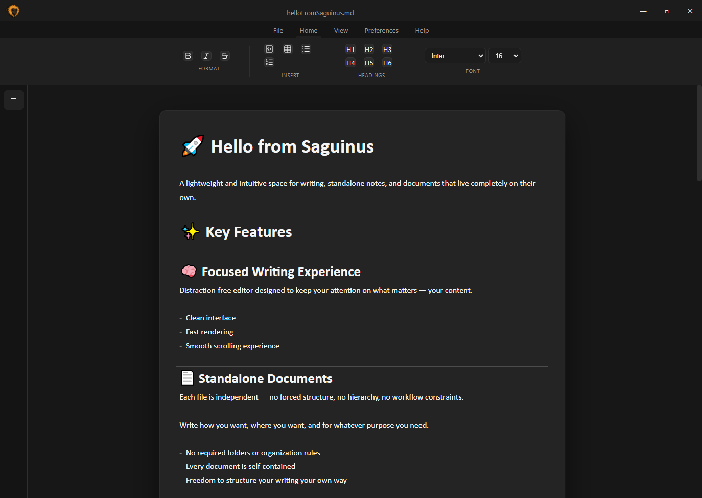

# 🚀 Saguinus

A document-focused writing environment powered by Markdown.

Saguinus is designed to feel like a modern document editor, while using Markdown as its underlying format for structure and portability.

The goal is simple:  
write in a clean, document-style interface without losing the flexibility of Markdown.

---

## ✨ What Saguinus is

Saguinus is a **document writer**, not a notes system or knowledge base.

It focuses on:

- Writing structured documents in a familiar editor-like experience
- Keeping content as standalone files
- Using Markdown internally for consistency and portability
- Providing a smooth, document-first workflow

You write like you would in a traditional document editor, while Markdown handles structure behind the scenes.

---

## 🧠 Key Capabilities

### 📝 Document-first editing experience
Saguinus is designed to behave like a modern writing environment:

- Continuous document flow (not block-based note systems)
- Live rendering while editing
- Minimal UI interference

---

### ⚙️ Markdown-powered engine
All documents are based on Markdown internally.

This ensures:
- Clean structured output
- Portability of content
- Predictable formatting behavior

Markdown is not the interface — it is the foundation.

---

### 📄 Independent documents
Each file is a standalone document.

There are no required folders, hierarchies, or systems to manage — just documents.

---

### 🖼️ Media support
Images can be embedded directly into documents and aligned:

- Left
- Center
- Right

---

### ⚡ Writing shortcuts
Keyboard shortcuts for faster document editing:

- Bold
- Italic
- Save
- New document
- Export to PDF

---

## 🖼️ Preview

---

## ⚠️ Project Status

Saguinus is in active pre-release development.

Core document editing is functional, but export and formatting systems are still evolving.

---

## 🔧 Known Issues

### Editor & rendering
- Minor layout shifts during rendering cycles
- Window resizing inconsistencies in some cases
- New documents may load with a short delay

### Export system
- Preview and PDF export may not always match exactly
- PDF filename does not yet use custom export name
- Export font styling is unstable (especially font size)

### Formatting limitations
- Links not yet implemented
- Mathematical expressions not yet implemented
- Strikethrough not yet implemented
- Checkbox lists not yet implemented

### Editing behavior
- Code block duplication may occur when pasting
- Inline formatting is not consistently serialized to Markdown

---

## 🚀 Direction

Current focus:
- Stabilizing export consistency (Preview → PDF alignment)
- Improving formatting system reliability
- Expanding Markdown feature coverage

---

## 🎯 Goal

Saguinus aims to provide a clean, document-first writing experience with the flexibility and structure of Markdown underneath.
